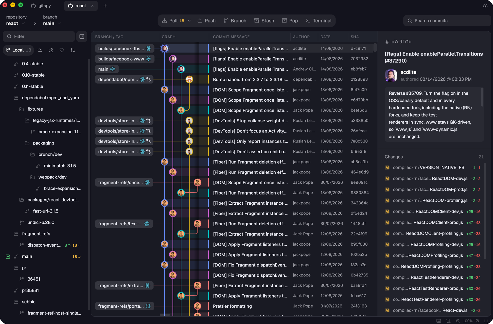

<p align="center">
  
</p>

<h1 align="center">gitspy</h1>

<p align="center">
  A free, open-source desktop git client.<br />
  Commit graph, staging, diffs, a merge conflict editor and GitHub / GitLab / Bitbucket sign-in — in a native app.
</p>

<p align="center">
  <a href="https://github.com/pr0ddd/gitspy/releases/latest"></a>
  <a href="https://github.com/pr0ddd/gitspy/actions/workflows/ci.yml"></a>
  <a href="https://github.com/pr0ddd/gitspy/releases"></a>
  <a href="LICENSE"></a>
</p>

<p align="center">
  
</p>

## What it does

- **Graph & history** — branch and tag labels on the commits, avatars, an
  optional minimap, columns you resize and hide; search commits, see a file's
  history and blame, open a commit's files in inline, split or hunk view.
- **Working tree** — stage by file or by hunk, path or tree view, amend, push
  after commit. Optionally, a local model (Ollama or LM Studio) writes the
  commit message from what you staged.
- **Merge conflicts** — yours, theirs and the result side by side, with syntax
  highlighting; take whole blocks or single lines, edit the result by hand,
  save.
- **Branches, tags, stashes, worktrees** — a tree on the left, checkout by
  double-click, ahead/behind counts, a marker on branches whose remote is gone
  with one-click cleanup. Every destructive action asks first; force push is
  offered only after a rejected push, and only with `--force-with-lease`.
- **GitHub, GitLab, Bitbucket** — sign in, see the repository's pull requests
  and check them out, clone from your account, create a repository on the host.
- **Terminal** — a shell in a dock under the graph, several tabs per
  repository. PowerShell or cmd on Windows.
- **Updates** — the app updates itself from GitHub Releases. No telemetry, no
  account.

## Not there yet

What gitspy does not have today:

- Interactive rebase; dragging branches or commits on the graph.
- Submodule and Git LFS screens (git handles them, gitspy just shows the
  result).
- Commit signing and SSH key management.
- Issue trackers, teams, cloud patches.
- A signed Windows build (SmartScreen warns until there is a certificate).

If one of these is what keeps you on another client,
[open an issue](https://github.com/pr0ddd/gitspy/issues/new/choose) — that
is how the list gets shorter.

## Download

Get the [latest release](https://github.com/pr0ddd/gitspy/releases/latest):

| Platform             | File                                       |
| -------------------- | ------------------------------------------ |
| macOS, Apple Silicon | `gitspy_<version>_aarch64.dmg`             |
| macOS, Intel         | `gitspy_<version>_x64.dmg`                 |
| Linux                | `.AppImage`, `.deb` or `.rpm`              |
| Windows              | `gitspy_<version>_x64-setup.exe` or `.msi` |

macOS builds are signed and notarised. The Windows build is not signed yet, so
SmartScreen will warn once. Updates arrive on their own: the app downloads a
new version in the background and offers a restart.

## Status

gitspy has been used daily on macOS for a while. The Linux and Windows builds
come from the same code but have had far less use — please
[report](https://github.com/pr0ddd/gitspy/issues/new/choose) anything odd; the
output of the same git command in a terminal helps most.

## Build from source

You need Rust 1.85+, Node 22+, and on Linux the Tauri packages
(`libwebkit2gtk-4.1-dev libgtk-3-dev libayatana-appindicator3-dev librsvg2-dev libxdo-dev libssl-dev patchelf`).

```bash
npm ci
npm run app            # run in development mode
npm run tauri build    # build the installer for your platform
```

`npm run build`, `cargo test`, `cargo clippy --all-targets -- -D warnings` and
`cargo fmt --all -- --check` are the gates CI runs; CI adds the licence checks
and the OAuth relay's tests.

## Under the hood

| Part                  | Does                                                             |
| --------------------- | ---------------------------------------------------------------- |
| `crates/gitspy-core`  | Lays out the graph (lanes, colours, lines); knows nothing of git |
| `crates/gitspy-repo`  | Reads commits and objects through gix                            |
| `crates/gitspy-exec`  | Runs system git for repository state and every write             |
| `crates/gitspy-hosts` | GitHub, GitLab and Bitbucket APIs                                |
| `crates/gitspy-term`  | Terminal sessions                                                |
| `crates/gitspy-ai`    | Commit messages from a local model                               |
| `src-tauri`           | The Tauri app: commands, open repositories, file watching        |
| `src`                 | The interface: React, canvas, Monaco                             |

Reads go through [gix](https://github.com/GitoxideLabs/gitoxide); anything
that changes the repository or answers a question about its state goes through
your own installed git, so what gitspy shows is what `git status` says.

Contributions are welcome — see [CONTRIBUTING.md](CONTRIBUTING.md). The
detailed rules the code follows are in [CLAUDE.md](CLAUDE.md).

## Licence

Copyright © 2026 Pavel Erohovets.
[GNU Affero General Public License v3.0](LICENSE). Third-party components and
their licences are listed in [THIRD-PARTY.md](THIRD-PARTY.md).
